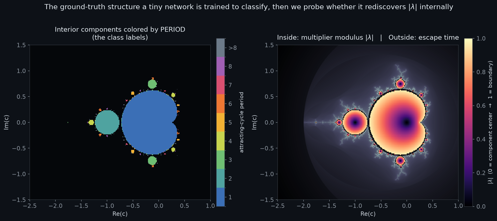

# mandel-interp

**What algorithm does a tiny neural network learn when you train it on a fractal?**

A small MLP is trained to classify points of the Mandelbrot set by the *period* of the
hyperbolic component they fall in. Then we open the network up and ask a sharp question:
did it rediscover the real mathematics of the problem, the multiplier map |λ| that working
mathematicians use as each component's natural internal coordinate, or did it just memorize
a lookup table of which side of the boundary each point is on?

---

## The question

The Mandelbrot set looks impossibly intricate, but its structure is *exactly computable*:
for any point `c` you can determine, with no ambiguity, whether it escapes, what period its
interior cycle has, and the precise value of a hidden coordinate called the **multiplier
modulus |λ|** that runs from 0 at a component's center to 1 at its boundary.

That exactness is the whole point. Most interpretability research has to guess at what a
network "should" represent. Here the ground truth is a theorem, not a hunch, so when I look
inside a trained net and ask "is |λ| in here?", I can give a clean, causal answer. Either way
the answer is worth having. If the network builds |λ|, then a tiny net rediscovered a piece of
complex-dynamics theory from nothing but coordinates and labels, which is a concrete world model
on a continuous task rather than the usual discrete-board setting. If it doesn't, I get a crisp
account of what small networks learn instead, namely a boundary-memorizer, and why.



*The ground-truth structure a tiny network is trained to classify, then we probe whether it
rediscovers |λ| internally. **Left:** interior hyperbolic components colored by the period of
their attracting cycle (these are the class labels). **Right:** the multiplier modulus |λ|
inside each component (dark center → bright boundary) with smooth escape-time shading outside.
Both panels are computed exactly from the dynamics, not from any model.*

---

## How it works

There is no dataset to download, because every label is computed. A validated dynamics core
(`src/dynamics.py`) gives me the period, the multiplier modulus |λ| (via Newton-refined
cycles), and the escape-side Green's function G(c) for any point c, all generated
deterministically from a fixed seed. The network itself is deliberately plain: an MLP that
sees only the raw coordinates `(Re c, Im c)`, with no Fourier features and nothing
hand-engineered, so whatever structure it ends up representing it had to build on its own. The
architecture is frozen in the pre-registration.

To read that structure out, I fit probes for |λ|, G(c), and a control coordinate on every
hidden layer and measure held-out R². The catch with any probing result is that a probe can fit
almost anything given rich enough features, so the same probes are run on an untrained net and
on a net trained with shuffled labels, and a representation claim only counts if the trained net
beats both of those controls. Correlation isn't the finish line either: I ablate the top probe
directions and patch activations between points at different |λ|, then check whether the
network's predictions actually move when I disturb the structure I claim to have found.

---

## What makes it rigorous

The whole design is pre-registered. Every hypothesis, threshold, and probe protocol went into
[`PRE_REGISTRATION.md`](PRE_REGISTRATION.md) with a git timestamp before any network was
trained, which is what keeps a "the net encodes |λ|" claim from being a story fit after the
fact. The boundary-memorizer outcome is written up in advance too, and it carries the same
weight as a positive finding, so a clean null is a real result here rather than a
disappointment.

The controls do actual work. The untrained-net and shuffled-label baselines are required
passes, not decoration bolted on at the end. Everything reproduces from scratch on a laptop
CPU: labels come from a fixed seed and the dynamics core is validated against points whose math
is known analytically. Results are reported across five seeds with bootstrap confidence
intervals, and the hard boundary region is always shown rather than quietly dropped.

---

## Status

Pre-registration locked (2026-06-11); the dynamics core and the training/probing/ablation
harness are built and tested. **No network has been trained yet**; the figure above is exact
ground-truth structure, not a model output. Training and the interpretability analysis run next.

---

## Reproduce

One path, four stages. Stages 0 and 1 are CPU-only and run in seconds to minutes. Stages 2
and 3 are the gated research run (the full 2M-point dataset and the 5-seed training/probing
sweep); they are deliberately NOT triggered by importing any module and must be invoked
explicitly.

```bash
# stage 0: environment + the showpiece figure (CPU, seconds; reproduces byte-for-byte)
python -m venv .venv && source .venv/bin/activate
pip install -r requirements.txt
python -m src.figures.showpiece                  # -> docs/figures/mandelbrot_label_structure.png

# stage 0b: validate the dynamics core against known-math points (CPU, seconds)
python -m pytest -q                              # 35 contract + ground-truth tests

# stage 1: sanity-check the whole pipeline on a tiny slice (CPU, ~1 min; deletes its own
#          artifacts and records NO outcome numbers, plumbing only, not a research run)
python -m src.smoke_test

# stage 2: GATED: generate the pre-registered dataset (CPU-heavy; ~2M points x up to 50k
#           iterations; writes gitignored arrays under data/ + a manifest to results/)
python -m src.build_dataset --n 2000000 --boundary-frac 0.35 --max-iter 50000
#   (quick check first: python -m src.build_dataset --smoke   # 600 points)

# stage 3: GATED: the 5-seed training + probing + ablation sweep (PyTorch CPU/MPS)
python -m src.train     --data-dir data --out-dir checkpoints                       # seeds 0..4
python -m src.train     --data-dir data --out-dir checkpoints --shuffle-labels       # probe-power control
python -m src.probes    --checkpoint checkpoints/seed0/best.pt --data-dir data --out results/probes_seed0.json
python -m src.probes    --untrained --seed 0 --data-dir data --out results/probes_seed0_untrained.json
python -m src.ablations --checkpoint checkpoints/seed0/best.pt --data-dir data --out results/ablations_seed0.json
```

No dataset to download: every label is computed from the dynamics. The one external file,
the period-1..32 component centers on Zenodo (record 10.5281/zenodo.15527027, ~560 GB), is a
*label cross-check only* and is **not** required to reproduce; `src/probes.py` recomputes the
period-1..8 centers it needs independently by Newton's method.

## Links

- **Pre-registration & method (locked, timestamped):** [`PRE_REGISTRATION.md`](PRE_REGISTRATION.md)
- **Dynamics core (exact labels):** [`src/dynamics.py`](src/dynamics.py)
- **Dataset builder (deterministic, seed 20260611):** [`src/build_dataset.py`](src/build_dataset.py)
- **Training harness (frozen MLP):** [`src/train.py`](src/train.py)
- **Probes + controls / causal ablations:** [`src/probes.py`](src/probes.py), [`src/ablations.py`](src/ablations.py)
- **Figure generator:** [`src/figures/showpiece.py`](src/figures/showpiece.py)
- **Prior art + how this differs:** [`docs/related_work.md`](docs/related_work.md)

License: code MIT (planned); released dataset CC BY 4.0.
